# My Voxel Engine Journey 
Hello, this is where I'm learning OpenGl and modern C++ by building a voxel engine.  Since I will be always changing the code around to learn new concepts, I want to keep in memory all the graphics that I produced.  Below is my journey of every graphic I created, sorted from earliest to latest. 
 <table><tr><tr>
            <td valign="bottom">
            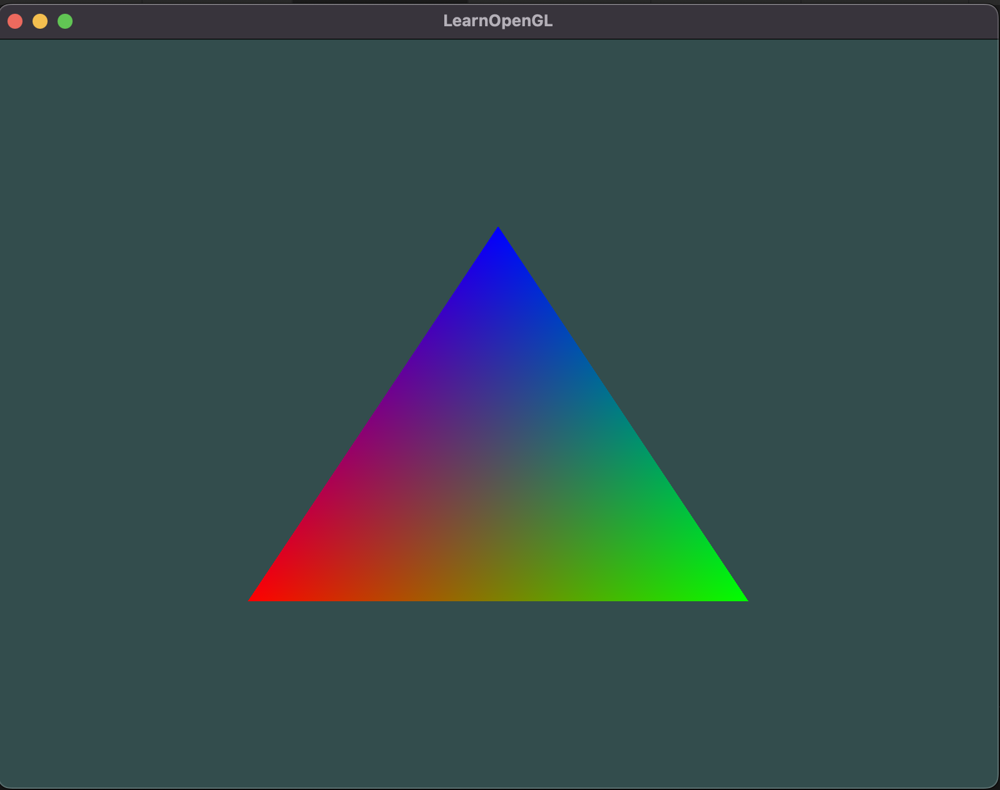 
            FragmentInterpolation.png | Dec 24 2022
            </td>
            <td valign="bottom">
            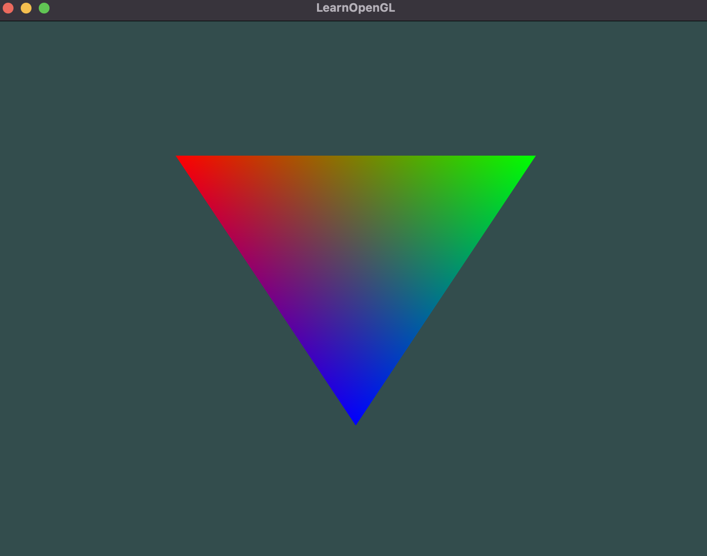 
            UpsideDownVertexShader.png | Dec 25 2022
            </td>
            <td valign="bottom">
            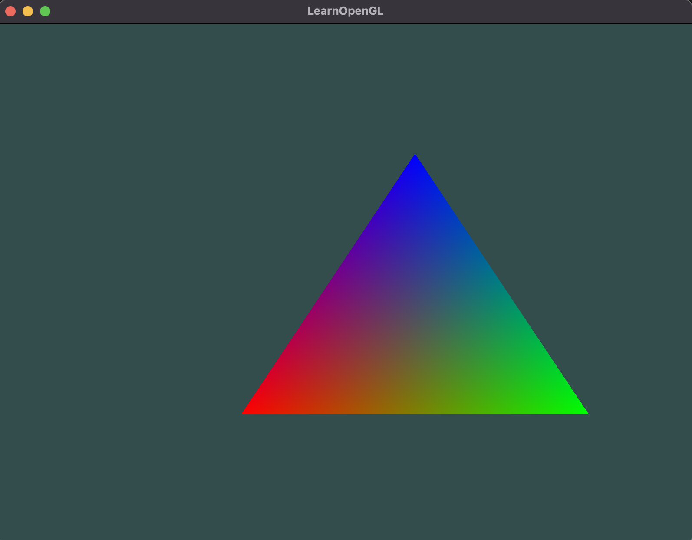 
            OffsetTriangle.png | Dec 25 2022
            </td>
            <td valign="bottom">
            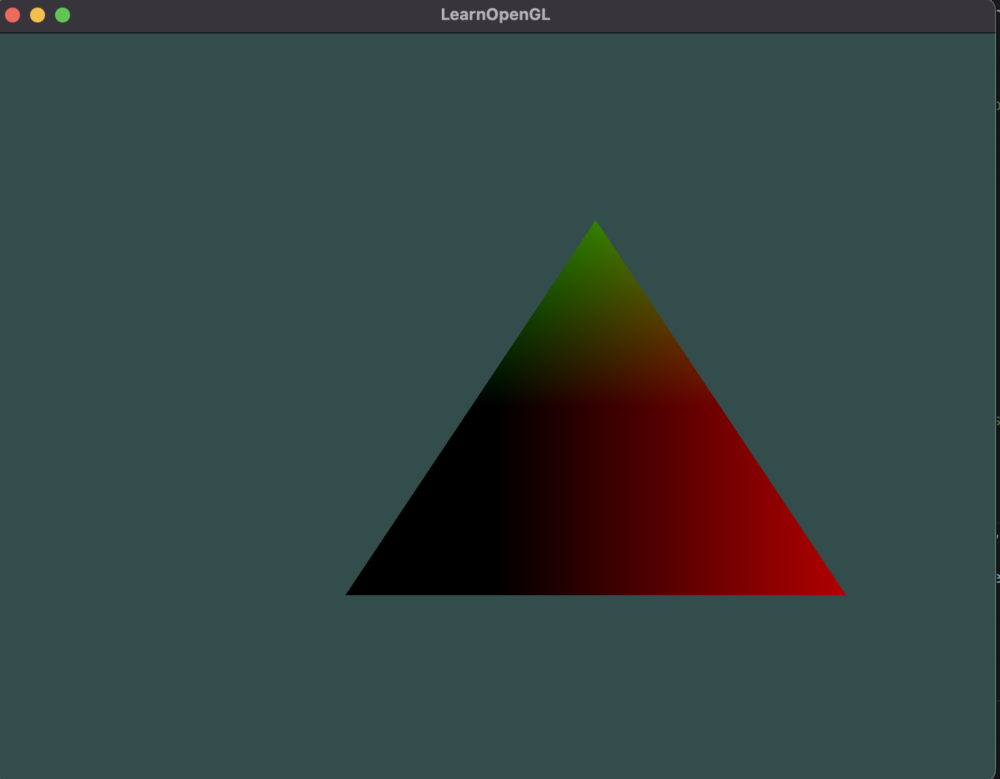 
            VertexPositionAsColor.png | Dec 25 2022
            </td></tr><tr>
            <td valign="bottom">
            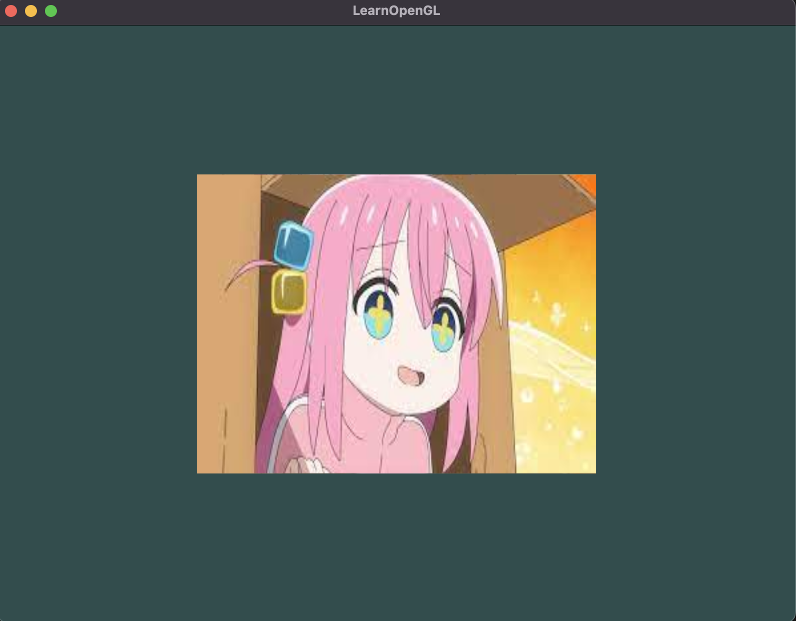 
            BocchiTexture.png | Dec 26 2022
            </td>
            <td valign="bottom">
            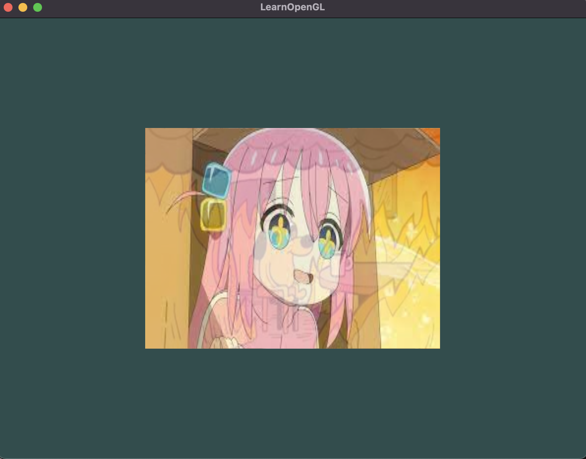 
            MixedTextures.png | Dec 27 2022
            </td>
            <td valign="bottom">
            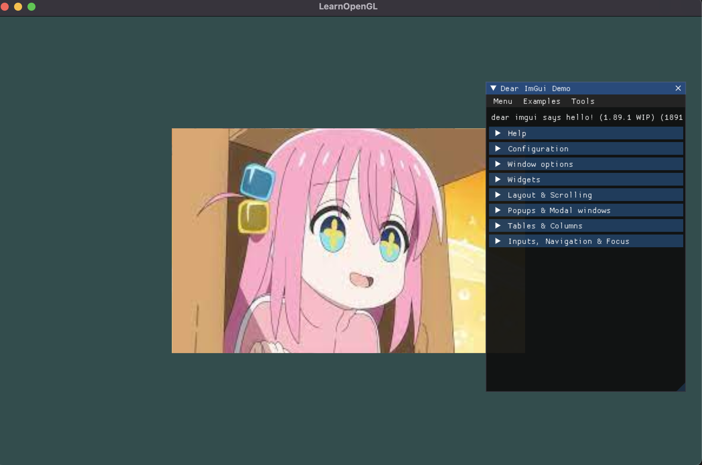 
            ImGuiDemo.png | Dec 27 2022
            </td>
            <td valign="bottom">
             
            BlendedTexturesImGui.gif | Dec 27 2022
            </td></tr><tr>
            <td valign="bottom">
            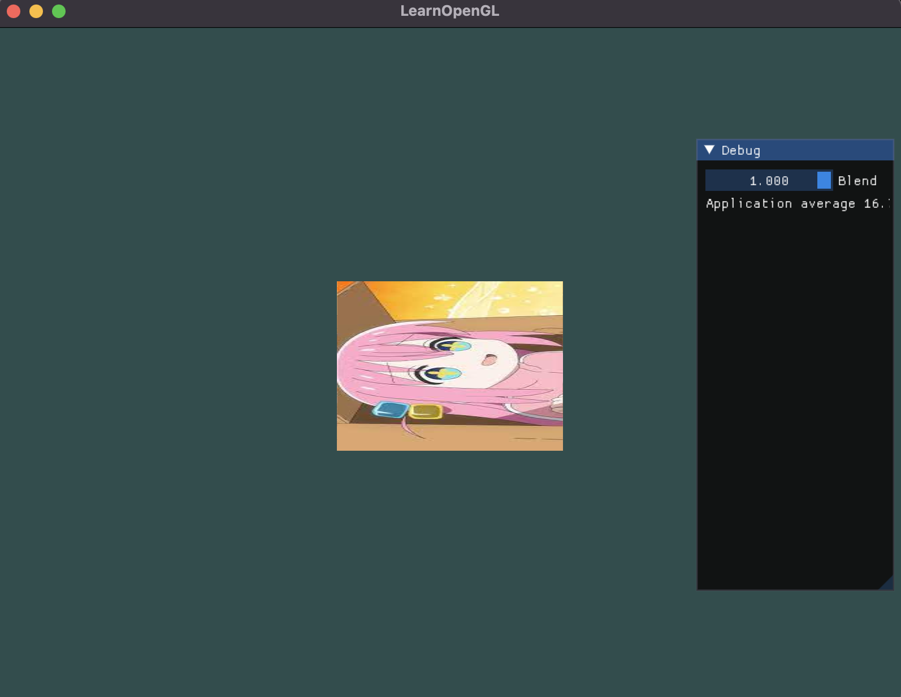 
            RotatedScaled.png | Dec 28 2022
            </td>
            <td valign="bottom">
             
            BocchiSpin.gif | Dec 28 2022
            </td>
            <td valign="bottom">
            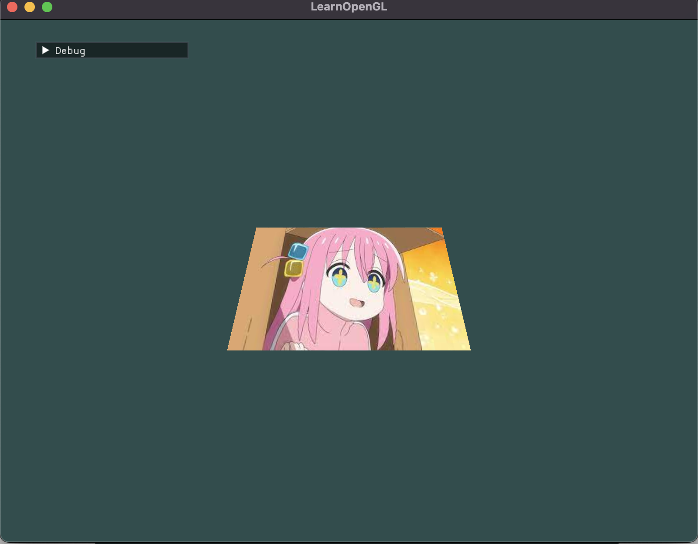 
            CameraCoords.png | Dec 29 2022
            </td>
            <td valign="bottom">
            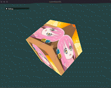 
            BocchiCube.gif | Dec 30 2022
            </td></tr><tr>
            <td valign="bottom">
            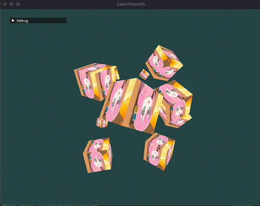 
            BocchiCubes.gif | Dec 30 2022
            </td>
            <td valign="bottom">
            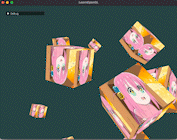 
            BocchiCam.gif | Dec 31 2022
            </td>
            <td valign="bottom">
            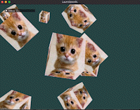 
            ElGatoZoom.gif | Dec 31 2022
            </td>
            <td valign="bottom">
            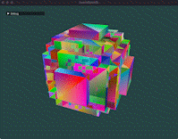 
            VoxelSphereCube.gif | Jan 09 2023
            </td></tr><tr>
            <td valign="bottom">
            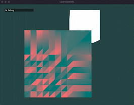 
            LightSource.gif | Jan 10 2023
            </td>
            <td valign="bottom">
             
            DiffuseLighting.gif | Jan 11 2023
            </td>
            <td valign="bottom">
            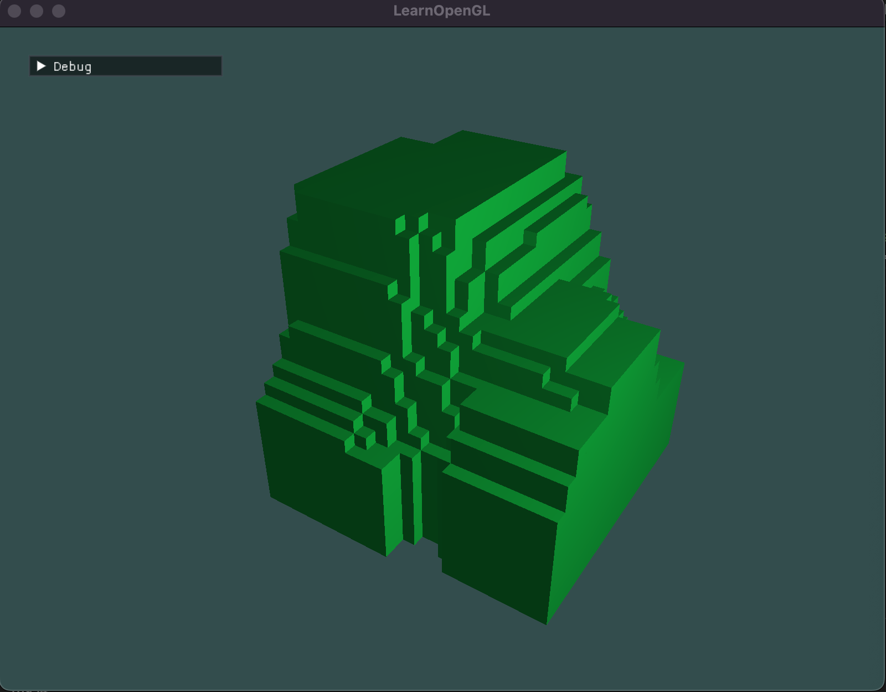 
            LandscapeChunk.png | Jan 11 2023
            </td>
            <td valign="bottom">
             
            RandomizedChunk.gif | Jan 12 2023
            </td></tr><tr>
            <td valign="bottom">
            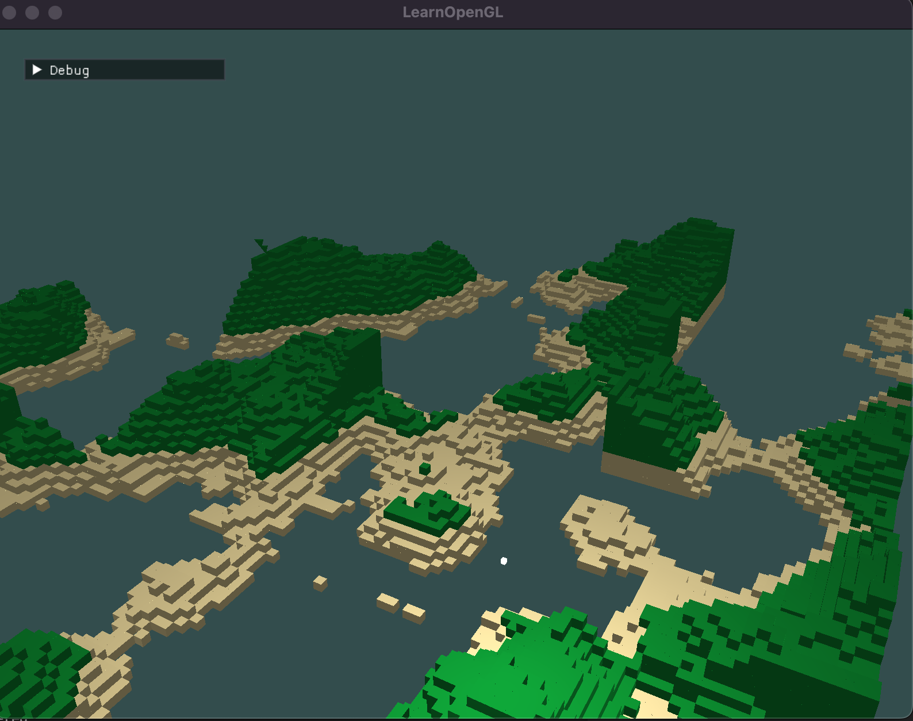 
            Sand.png | Jan 14 2023
            </td>
            <td valign="bottom">
            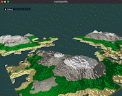 
            FirstWorld.gif | Jan 14 2023
            </td>
            <td valign="bottom">
            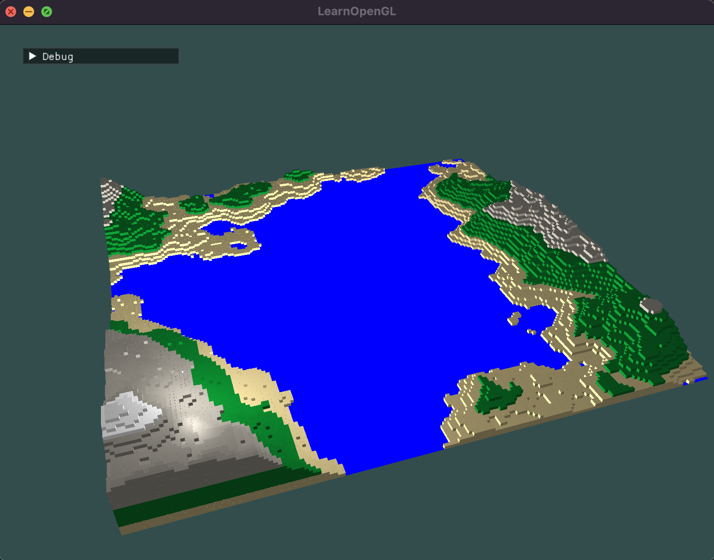 
            SimpleWater.png | Jan 16 2023
            </td>
            <td valign="bottom">
            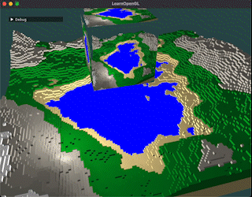 
            FrameBuffer.gif | Jan 18 2023
            </td></tr><tr>
            <td valign="bottom">
            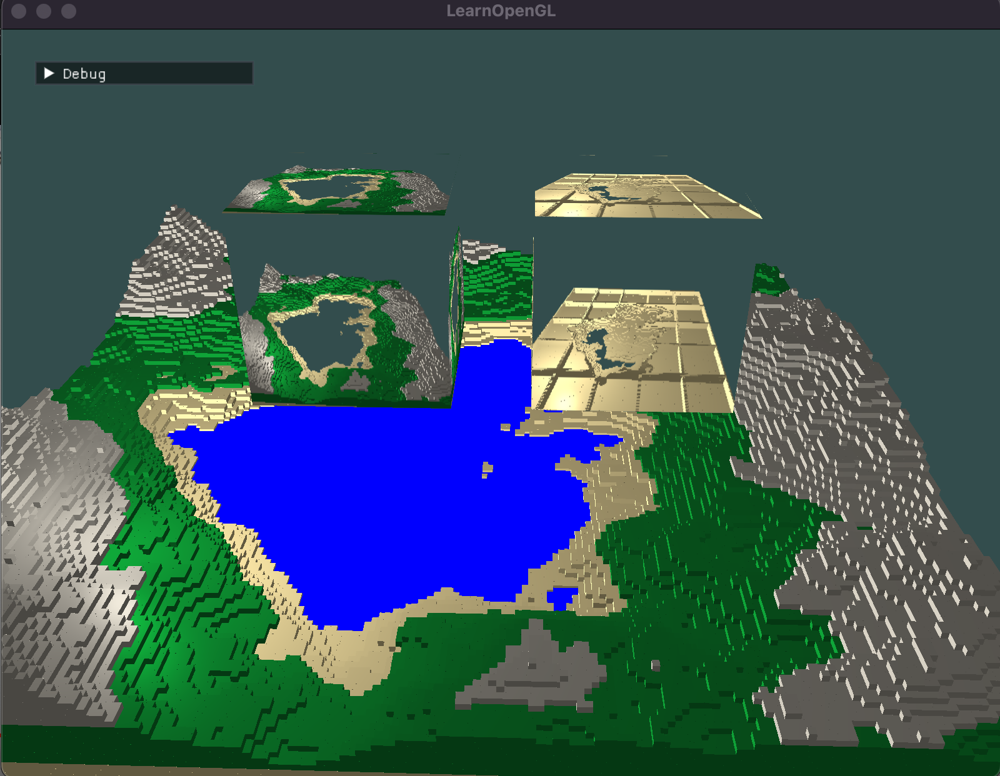 
            ReflectRefract.png | Jan 18 2023
            </td>
            <td valign="bottom">
             
            UglyWater.gif | Jan 19 2023
            </td>
            <td valign="bottom">
             
            AverageWater.gif | Jan 19 2023
            </td>
            <td valign="bottom">
             
            PrettyWater.gif | Jan 19 2023
            </td></tr><tr>
            <td valign="bottom">
             
            FresnelEffect.gif | Jan 19 2023
            </td>
            <td valign="bottom">
             
            SpecularLighting.gif | Jan 19 2023
            </td>
            <td valign="bottom">
             
            Peace.gif | Jan 20 2023
            </td></tr></table>

# Journal

## Dec 23
Created a function to parse shader text files into a shader source:
* Used ifstream object and getline to read file line by line.
* Used an enum class to map shader type to an integer.
* Added relevant lines using stringstream object.
* Reduced nested code from 2 to 1 using extraction and inversion.
* Pics: FragmentInterpolation

## Dec 24
Played around with Shaders
* Green triangles faded in and out using uniforms to draw colors based on sin of time.
* Rainbow triangle made through fragment interpolation, supplying only 3 colors to vertex.
* Pics: FragmentInterpolation

## Dec 25
* Built class for managing Shaders more efficiently
* Played around with shaders to get the pics
* Pics: Offset, UpsideDown, VertexPosition

## Dec 26
* Built class for managing/loading in Textures
* Loaded in Texture through fragment shader and stb_image for loading.
* Pics: BocchiTexture

## Dec 27
* Accounted for texture units in order to have multiple textures
* Incorporated imgui to blend textures with slider
* Pics: MixedTextures, imguiDemo, blendedTexturesImGui

## Dec 28
* Added GLM library for math
* Transform image using rotation and scaling.
* Pics: RotatedScaled, BocchiSpin

## Dec 29
* Learned the cameria coordinate pipeline
  * Local Space -> Model Matrix -> World Space -> View Matrix -> View Space -> Projection Matrix -> Clip Space -> Viewport Transformation -> Screen Space
* Pics: CameraCoord
  
## Dec 30
* Converted 2d plane to 3d cube.
* Played around with altering fov and transformation matrices.
* Pics: BocchiCube, BocchiCubes

## Dec 31
* Implemented working camera with translation and rotation
* Pics: BoochiCam, ElGatoZoom

## Jan 2
* Added Vertex Array Class to handle vertex buffers
* Finished draw function in Renderer Class

## Jan 9
* Finally was able to render a voxel sphere.  It took me a long time to find out the bug, which was my render class was only rendering 36 vertices, or just 1 cube.  Increasing this parameter rendered the sphere.  Another problem came up- the sphere is not a full sphere.  Some cubes are missing, and im unsure why.  UGHHHHHH
* Pics: voxelSphereCube

## Jan 10
* Modified vertex format to be a property of VAO
* Added new light source shader and light source VAO.
* Made bindVBO const to avoid the 2 hour bug i had.
* Pics: lightSource

## Jan 11
* Added ambient and diffuse lighting
* Added libnoise library
* First terrain generation using perlin noise!
* Pics: DiffuseLighting, LandscapeChunk

## Jan 12
* Read about SOLID design principles
* SRP - Single Responsibility Principle
  * "A class should only have one reason to change"
* OCP – Open/Closed Principle
  * "classes should be open for extension, closed for modification"
* LSP – Liskov Substitution Principle
  * "Subtypes must be substitutable for their base types without altering the correctness of the program"
* ISP – Interface Segregation Principle
  * "Clients should not be forced to depend on interfaces that they do not use."
* DIP – Dependency Inversion Principle
  * "Abstractions should not depend on details. Details should depend on abstractions."
* Source: http://www.vishalchovatiya.com/single-responsibility-principle-in-cpp-solid-as-a-rock/
* Optimized chunk by not renderering hidden blocks.  This reduced average blocks/chunk from 1000 to 250 for 16x16x16blocks, about 400% more optimized.
* Pics: RandomizedChunk

## Jan 14
* Fixed chunk not loading correctly (hiddenblocks func) (scaling first then translating)
* Added sand
* LETS GOO I FIXED THE TERRAIN GEN.  I had to 
  1. change setDstImage to 32 by 32 so each heightmap only has 32 possible values instead of 256*256.
  2. change getValue() parameters to only range [0,31] because anything over is out of bounds.
  3. Render z axis starting from top since the way my cube is oritented with (0,0,0) being the left, bottom, away from screen corner.
* Pics: Sand, FirstWorld

## Jan 15
* Wrote quick blog post on how to generate voxel terrain using Perlin noise
  * https://vincenguyen.super.site/blog/blog-posts-1/how-to-generate-voxel-terrain-using-perlin-noise
* Going to learn fluid dynamics to add water.

## Jan 16
* Looked into Cellular Automata, Game of Life, fluid simulation
* pics: SimpleWater
  
## Jan 17
* Added water renderer and water shader class.
* Encountered a bug where VBO id was not founded.  I realized I failed to set the corresponding VAO correctly.

## Jan 18
* Finished testing out frame buffer object
  * Realized that I needed to reset the buffers within frame buffer object.
* Struggled with getting the refraction texture to work.  Turns out, both reflection and refraction fbos were equal to 1 because my function, createFrameBuffer() did not have a return...
* Learned how to use clipping planes in vertex shaders.  Specify a clipping plane with (normal.x, normal.y, normal.z, dist from origin)
* Pics: FrameBuffer, ReflectRefract

## Jan 19
* Combined both textures onto the water.  IT LOOKS SO BADD
* Used projective mapping (converted texture coords from clipspace to normalized device coords so the textures line up)
  * Sources: https://antongerdelan.net/opengl/raycasting.html#:~:text=Overview,is%20usually%20called%20ray%20casting.  The 3d transformation pipeline graphic helped me alot.
* Applied water dudv mapping + distortions/offsets to get animated water.
* Added Fresnel Effect where:
  * Looking from above water surface gives more refraction.
  * Looking eye level to water surface gives more reflection.
* Used normal mapping texture to distort the water surface normals, then applied specular lighting.
* Pics: UglyWater, AverageWater, PrettyWater, FresnelEffect, SpecularLighting

## Jan 20
* Struggled so long on getting depth texture to work... ended up giving up since smooth edges is not really needed for a voxel terrain.
* Localized watertile to each chunk for easier world generation.  The lag is a little stronger tho, might need to work on loading/unloading chunks based on view position and render distance.
* Going to start writing a blog post about the intuition behind rendering scenic water now!
* Pics: Peace

## Jan 21
* Looking into contributing to open source game engines.  Looks very intimidating D:

## Jan 22
* First pull request got merged on Godot game engine!!
  * Just the docs change tho but still proud!

## Jan 23
* Finished my blog post on rendering water, read here:
  * https://vincenguyen.super.site/blog/blog-posts-1/how-to-render-pretty-water
