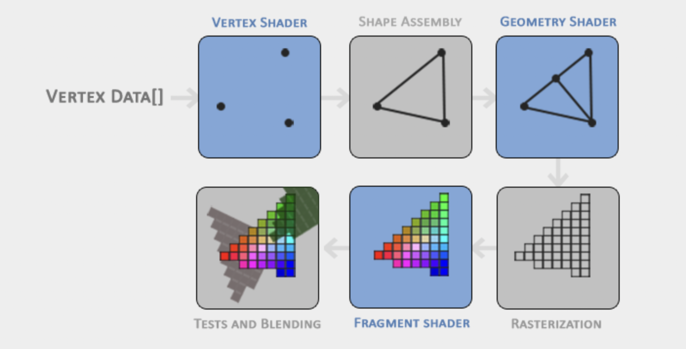

# Graphics Pipeline:

1. **Vertex Shader** -  takes as input a single vertex and transform 3D coordinates into different 3D coordinates (more on that later) and the vertex shader allows us to do some basic processing on the vertex attributes.

2. **Primitive Assembly** - takes as input all the vertices from the vertex shader that form a primitive and assembles all the point(s) in the primitive shape given.

3. **Geometry Shader** - takes as input a collection of vertices that form a primitive and has the ability to generate other shapes by emitting new vertices to form new (or other) primitive(s).

4. **Rasterization Stage** - maps the resulting primitive(s) to the corresponding pixels on the final screen resulting in fragments.

5. **Fragment Shader** - calculate the final color of a pixel and this is usually the stage where all the advanced OpenGL effects occur.

6. **Alpha Test + Blending** - checks the corresponding depth value of the fragment and uses those to check if the resulting fragment is in front or behind other objects and should be discarded accordingly. The stage also checks for alpha values (opacity values) and blends the objects accordingly.
---
